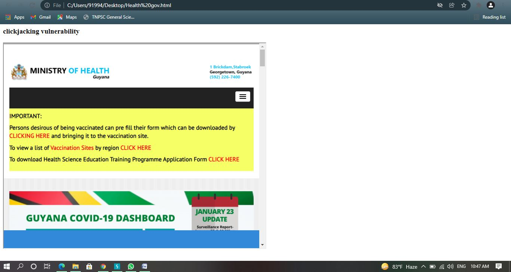

# Security Vulnerability Research - Government Healthcare Website

> **Disclaimer:** This research was conducted ethically for educational purposes and reported responsibly to relevant authorities. All testing was performed within legal boundaries without causing harm or disruption to services.

## Executive Summary

Discovered multiple security vulnerabilities in Guyana Ministry of Health website (health.gov.gy) through responsible security research. The findings include critical security misconfigurations that could potentially expose sensitive information and compromise user security.

**Key Findings:**
- **Clickjacking vulnerability** - Missing X-Frame-Options header
- **Directory Listing exposure** - Server misconfiguration allowing unauthorized file access
- **Improper security headers** - Multiple missing security controls

---

## 🔍 Vulnerabilities Identified

### 1. Clickjacking Vulnerability (OWASP A05:2021)

**Severity:** Medium  
**CVSS v3.1 Score:** 4.3  
**CWE:** CWE-1021 (Improper Restriction of Rendered UI Layers)

**Description:**  
The website lacks proper X-Frame-Options headers, allowing it to be embedded in iframe elements. This configuration enables potential clickjacking attacks where malicious actors can trick users into clicking on concealed elements, leading to unintended actions.

**Technical Impact:**
- Website can be embedded in malicious iframes
- Users may unknowingly perform actions while thinking they're interacting with legitimate content
- Potential for credential theft or unauthorized transactions
- Reputation damage and loss of user trust

**Proof of Concept:**
Successfully demonstrated iframe embedding of the target website:
```html
<iframe src="https://health.gov.gy/" width="100%" height="600px"></iframe>
```

**Evidence:**


---

### 2. Directory Listing Exposure

**Severity:** Medium to High  
**CVSS v3.1 Score:** 6.5  
**CWE:** CWE-548 (Directory Listing)

**Description:**  
Server misconfiguration allows directory listing, exposing the complete file structure and contents to any user. This vulnerability was discovered through OSINT techniques and confirmed via direct browser access.

**Discovery Method:**
- **Google Dorking query:** `inurl:"index of" gov.gy`
- Manual enumeration and verification
- Burp Suite analysis of server responses

**Technical Impact:**
- Complete file and directory structure exposed
- Potential access to sensitive documents, configuration files, or backups
- Information disclosure facilitating further reconnaissance
- Possible exposure of application source code or credentials

**Affected Paths:**
- `/data/` directory and subdirectories
- Multiple file types accessible without authentication

**Evidence:**


---

### 3. Missing Security Headers

**Severity:** Low to Medium

**Additional security headers missing:**
- `X-Frame-Options` - Allows clickjacking
- `Content-Security-Policy` - No CSP protection
- `X-Content-Type-Options` - MIME sniffing possible
- `Strict-Transport-Security` - No HTTPS enforcement

---

## 🛠️ Tools & Methodology

### Tools Used:
- **Burp Suite Community Edition** - Primary web application security testing tool
- **Google Dorking** - OSINT and reconnaissance techniques  
- **Browser Developer Tools** - Manual header inspection and validation
- **Custom HTML/JavaScript** - Proof of concept development

### Testing Methodology:

**Phase 1: Reconnaissance**
- OSINT gathering using search engines
- Google Dorking for information disclosure
- Target identification and scope definition

**Phase 2: Analysis**
- Burp Suite proxy interception and inspection
- HTTP header analysis and validation
- Server configuration assessment

**Phase 3: Validation**
- Manual testing to confirm vulnerabilities
- Proof of concept development
- Impact assessment and severity rating

**Phase 4: Documentation**
- Screenshot capture and evidence collection
- Detailed technical report generation
- Remediation recommendations

**Phase 5: Responsible Disclosure**
- Report submission to relevant authorities
- Following ethical disclosure practices
- Maintaining confidentiality

---

##  Recommendations

### Immediate Actions (High Priority):

**1. Fix Clickjacking Vulnerability:**

Add X-Frame-Options header to all responses:
```apache
# Apache (.htaccess or httpd.conf)
Header always set X-Frame-Options "DENY"
# or for same-origin only
Header always set X-Frame-Options "SAMEORIGIN"
```

```nginx
# Nginx (nginx.conf)
add_header X-Frame-Options "DENY" always;
# or for same-origin only
add_header X-Frame-Options "SAMEORIGIN" always;
```

**2. Disable Directory Listing:**

```apache
# Apache (.htaccess or httpd.conf)
Options -Indexes

# Or for specific directory
<Directory /path/to/data>
    Options -Indexes
</Directory>
```

```nginx
# Nginx (nginx.conf)
autoindex off;
```

**3. Implement Content Security Policy:**

```
Content-Security-Policy: frame-ancestors 'none';
```

---

### Long-term Security Improvements:

1. **Comprehensive Security Audit**
   - Full penetration testing of entire web infrastructure
   - Code review for additional vulnerabilities
   - Third-party security assessment

2. **Security Headers Implementation**
   ```
   X-Frame-Options: DENY
   Content-Security-Policy: default-src 'self'
   X-Content-Type-Options: nosniff
   Strict-Transport-Security: max-age=31536000; includeSubDomains
   Referrer-Policy: strict-origin-when-cross-origin
   Permissions-Policy: geolocation=(), microphone=(), camera=()
   ```

3. **Web Application Firewall (WAF)**
   - Implement WAF to detect and block common attacks
   - Rate limiting and DDoS protection
   - Regular rule updates and monitoring

4. **Security Development Lifecycle**
   - Secure coding training for development team
   - Regular security testing in CI/CD pipeline
   - Vulnerability scanning and patch management

5. **Monitoring and Incident Response**
   - Implement security logging and monitoring
   - Establish incident response procedures
   - Regular security reviews and updates

---

## 📅 Timeline

| Date | Activity |
|------|----------|
| Date | Activity |
|------|----------|
| **January 25, 2020** | Identified vulnerabilities through security research |
| **January 26, 2020** | Confirmed findings with multiple validation methods |
| **January 27, 2020** | Prepared detailed technical report with evidence |
| **January 28, 2020** | Responsibly reported to relevant authorities |
| **Status** | Disclosed Responsibly - Educational Documentation |

---

## ⚖️ Ethical Disclosure Statement

This security research was conducted in accordance with ethical hacking principles:

✅ **Legal Compliance:** All testing performed within legal boundaries  
✅ **No Harm:** No systems were damaged or disrupted  
✅ **No Data Exfiltration:** No sensitive data was accessed or stolen  
✅ **Responsible Disclosure:** Findings reported to proper authorities  
✅ **Educational Purpose:** Research conducted for security improvement  
✅ **Confidentiality:** Details shared only with authorized parties  

**No sensitive information from this research has been publicly disclosed.**

---

## 📊 Impact Assessment

### Risk Matrix:

| Vulnerability | Likelihood | Impact | Overall Risk |
|--------------|------------|---------|--------------|
| Clickjacking | Medium | Medium | **Medium** |
| Directory Listing | High | High | **High** |
| Missing Headers | High | Low-Medium | **Medium** |

### Potential Business Impact:
- Loss of user trust and confidence
- Regulatory compliance violations (GDPR, data protection laws)
- Potential data breaches and information disclosure
- Reputational damage to government healthcare services
- Legal and financial consequences

---

## 📚 References & Resources

**OWASP Resources:**
- [Clickjacking Defense Cheat Sheet](https://cheatsheetseries.owasp.org/cheatsheets/Clickjacking_Defense_Cheat_Sheet.html)
- [OWASP Top 10 - 2021](https://owasp.org/Top10/)
- [Security Headers Best Practices](https://owasp.org/www-project-secure-headers/)

**CWE References:**
- [CWE-1021: Improper Restriction of Rendered UI Layers](https://cwe.mitre.org/data/definitions/1021.html)
- [CWE-548: Directory Listing](https://cwe.mitre.org/data/definitions/548.html)

**Security Standards:**
- [CVSS v3.1 Calculator](https://www.first.org/cvss/calculator/3.1)
- [NIST Cybersecurity Framework](https://www.nist.gov/cyberframework)

---

## 🔒 Repository Structure

```
health-gov-gy-security-research/
├── README.md                          # This file - Overview and summary
├── FINDINGS.md                        # Detailed technical findings
└── screenshots/
    ├── 01_clickjacking_poc.png       # Clickjacking demonstration
    └── 02_burp_suite_analysis.png    # Burp Suite traffic analysis
```

---

## 👤 Researcher Information

**Raja R**  
Security Researcher | Cyber Forensics Graduate  
Specialization: Web Application Security, Penetration Testing, Vulnerability Research

**Contact:**
- 🔗 LinkedIn: [linkedin.com/in/rajar219](https://linkedin.com/in/rajar219)
- 🌐 Portfolio: [rajar219.github.io/bio](https://rajar219.github.io/bio/)
- 📧 Email: leviraja670@gmail.com
- 📍 Location: Chennai, Tamil Nadu, India

**Skills:**
- Penetration Testing & Vulnerability Assessment
- Web Application Security (OWASP Top 10)
- Security Tools: Burp Suite, Nmap, Wireshark
- Python Programming for Security
- Responsible Disclosure & Ethical Hacking

---

## 📄 License & Usage

This documentation is provided for **educational and informational purposes only**.

**Terms:**
- This research may be referenced for educational purposes
- Screenshots and technical details are for demonstration only
- Do not attempt to reproduce these tests without proper authorization
- Respect responsible disclosure guidelines

---

## 🙏 Acknowledgments

- OWASP Foundation for security resources and guidelines
- Burp Suite for comprehensive security testing tools
- The cybersecurity community for promoting ethical hacking practices

---

**Last Updated:** January 2025  
**Version:** 1.0  
**Status:** Disclosed Responsibly

---

> *"Security is not a product, but a process."* - Bruce Schneier

For questions or additional information about this research, please contact the researcher through the channels listed above.
